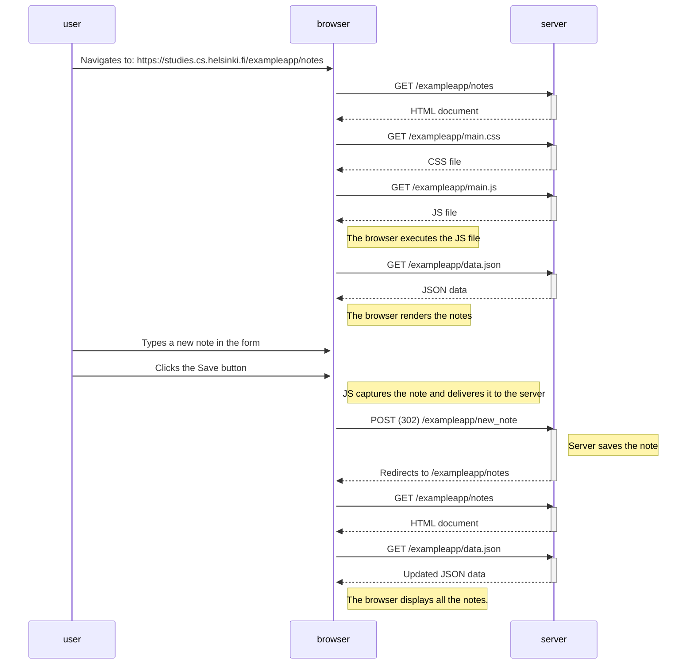

```mermaid
sequenceDiagram
    participant user
    participant browser
    participant server

    user->>browser: Navigates to: https://studies.cs.helsinki.fi/exampleapp/notes
    activate browser
    browser->>server: GET /exampleapp/notes
    activate server
    server-->>browser: HTML document
    deactivate server

    browser->>server: GET /exampleapp/main.css
    activate server
    server-->>browser: CSS file
    deactivate server

    browser->>server: GET /exampleapp/main.js
    activate server
    server-->>browser: JS file
    deactivate server

    Note right of browser: The browser executes the JS file

    browser->>server: GET /exampleapp/data.json
    activate server
    server-->>browser: JSON data
    deactivate server

    Note right of browser: The browser renders the notes

    user->>browser: Types a new note in the form
    user->>browser: Clicks the Save button

    Note right of browser: JS captures the note and deliveres it to the server

    browser->>server: POST (302) /exampleapp/new_note
    activate server
    Note right of server: Server saves the note
    server-->>browser: Redirects to /exampleapp/notes
    deactivate server

    browser->>server: GET /exampleapp/notes
    activate server
    server-->>browser: HTML document
    deactivate server

    browser->>server: GET /exampleapp/data.json
    activate server
    server-->>browser: Updated JSON data
    deactivate server

    Note right of browser: The browser displays all the notes.
```
