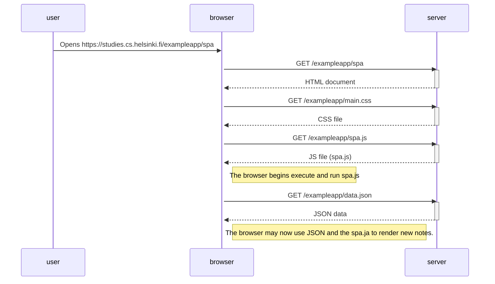

```mermaid
sequenceDiagram
    participant user
    participant browser
    participant server

    user->>browser: Opens https://studies.cs.helsinki.fi/exampleapp/spa
    activate browser
    browser->>server: GET /exampleapp/spa
    activate server
    server-->>browser: HTML document
    deactivate server

    browser->>server: GET /exampleapp/main.css
    activate server
    server-->>browser: CSS file
    deactivate server

    browser->>server: GET /exampleapp/spa.js
    activate server
    server-->>browser: JS file (spa.js)
    deactivate server

    Note right of browser: The browser begins execute and run spa.js

    browser->>server: GET /exampleapp/data.json
    activate server
    server-->>browser: JSON data
    deactivate server

    Note right of browser: The browser may now use JSON and the spa.ja to render new notes.

```
