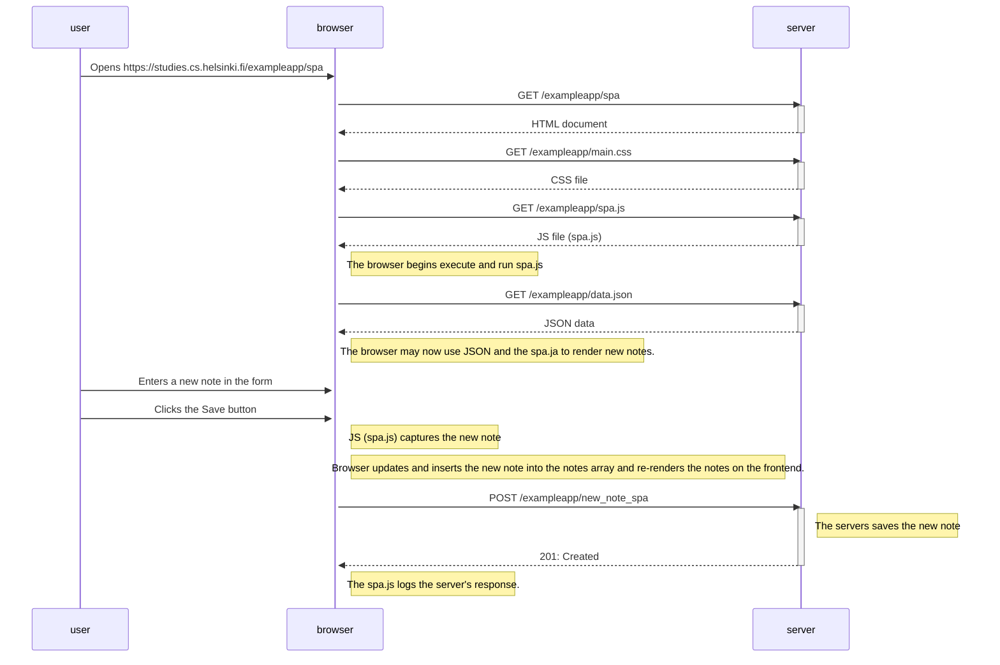

```mermaid

sequenceDiagram
participant user
participant browser
participant server


user->>browser: Opens https://studies.cs.helsinki.fi/exampleapp/spa
activate browser
browser->>server: GET /exampleapp/spa
activate server
server-->>browser: HTML document
deactivate server


browser->>server: GET /exampleapp/main.css
activate server
server-->>browser: CSS file
deactivate server


browser->>server: GET /exampleapp/spa.js
activate server
server-->>browser: JS file (spa.js)
deactivate server


Note right of browser: The browser begins execute and run spa.js


browser->>server: GET /exampleapp/data.json

activate server

server-->>browser: JSON data

deactivate server


Note right of browser: The browser may now use JSON and the spa.ja to render new notes.


user->>browser: Enters a new note in the form

user->>browser: Clicks the Save button


Note right of browser: JS (spa.js) captures the new note


Note right of browser: Browser updates and inserts the new note into the notes array and re-renders the notes on the frontend.


browser->>server: POST /exampleapp/new_note_spa

activate server

Note right of server: The servers saves the new note

server-->>browser: 201: Created

deactivate server


Note right of browser: The spa.js logs the server's response.


```
